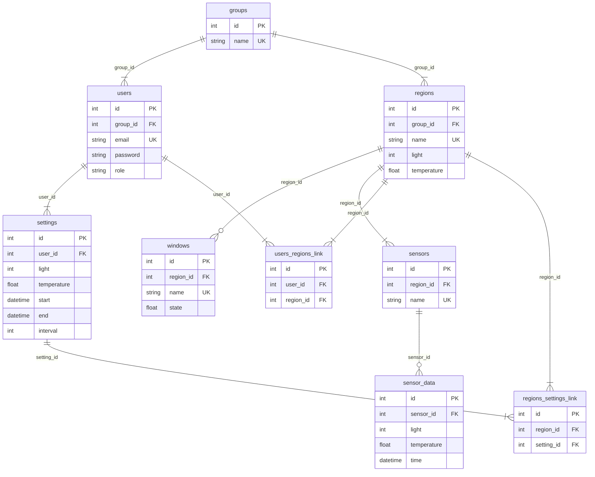
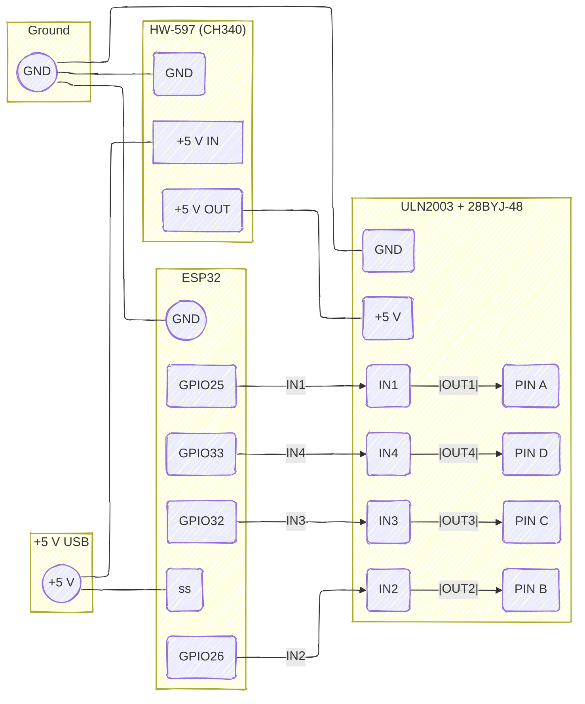
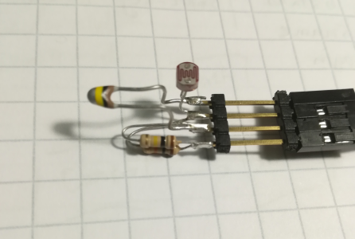

<div align="center">

# Smart Blinds

Simple auto blinds framework demo

</div>

## Design

The Smart Blinds system is designed to manage and automate the operation of
window blinds based on environmental data collected by sensors. The system
architecture includes multiple user groups, each containing several regions,
with each region capable of controlling multiple windows and sensors. This
modular design allows for scalable and customizable control over various
environments. At the same time, we have a user layer management, users can
schedule the desired brightness at different times through the gantt graph.


- Group: Represents a collection of users and sensors in a defined area.
- Admin: The user with administrative privileges who can oversee and manage the
  entire group.
- User A and User B: Regular users who control specific regions within the group.
- Sensors(A, B, C): Devices placed in various locations to collect data on light
  and temperature.
- Blinds: Mechanisms controlled by the system to adjust based on sensor data.

The following diagram illustrates the relationships between the different
entities within the system:



## Assembly

Follow these steps to assemble the sensor and blinds correctly.

### Materials

- 2x Arduino * (nano)
- 28BYJ-48 stepper motor
- Light dependent resistor(LDR) + Resistor for LDR
- NTC resistor + Resistor for NTC

### Procedural

1. Assemble the Stepper Motor:

   - Attach the 28BYJ-48 stepper motor to the Arduino Nano using appropriate
     driver circuitry.

   - Ensure the motor is firmly mounted to control the blinds mechanism.

   - Assemble conductive devices to connect blinds or curtains.



> [!NOTE]  
> If using ready-made sensor provider can skip the `step 2`

2. Assemble the Sensor:

   - Connect the LDR and its corresponding resistor to an analog pin on the
   Arduino Nano.

   - Connect the NTC resistor and its corresponding resistor to another analog
   pin on the Arduino Nano.

   - Ensure all connections are secure and insulated.

   


## Development

**Option 1: One click start**

For develop frontend or embedded side, could try one click start:

```bash
python bootstrap.py
```

**Option 2: Manual start**

To start the server, you will need `Rust` installed on your machine. Then, run
the following command:

```bash
cargo run --package lumisync-server --bin server
```

To work on the web application, you should have `Node.js(LTS version)` and `npm`
installed. Then, run the following command:

```bash
npm install
npm run web
```

**Database setup**

1. Create the database (require url format, for example `sqlite:debug.db`) and
   add migration script.

   ```bash
   sqlx database create --database-url <url>
   sqlx migrate add <name>
   ```

2. Check the new migration script under `migrations/<timestamp>_<name>.sql`. Add
   custom database schema changes to this file.

   ```sql
   -- Insert sample data into 'groups'
   INSERT INTO groups (name) VALUES ('sample');

   -- Insert sample data into 'users'
   -- Password: test
   INSERT INTO users (group_id, email, password, role) VALUES (1, 'test@test.com', '$argon2id$v=19$m=19456,t=2,p=1$zk5JmuovvG7B6vyGGmLxDQ$qoqCpKkqrgoVjeTGa5ewrqFpuPUisTCDnEiPz6Dh/oc', 'admin');

   -- Insert sample data into 'regions'
   INSERT INTO regions (group_id, name, light, temperature) VALUES (1, 'Living Room', 100, 22.5);

   -- Insert sample data into 'settings'
   INSERT INTO settings (user_id, light, temperature, start, end, interval) VALUES (1, 100, 22.5, DATETIME('now'), DATETIME('now', '+03:30'), 0);

   -- Insert sample data into 'windows'
   INSERT INTO windows (region_id, name, state) VALUES (1, 'Living Room Right Window', 0);

   -- Insert sample data into 'sensors'
   INSERT INTO sensors (region_id, name) VALUES (1, 'SENSOR-MOCK');

   -- Insert sample data into 'users_regions_link'
   INSERT INTO users_regions_link (user_id, region_id) VALUES (1, 1);

   -- Insert sample data into 'regions_settings_link'
   INSERT INTO regions_settings_link (region_id, setting_id) VALUES (1, 1);
   ```

3. Adjust config file for `configs/development.toml` with database url.

   ```toml
   [database]
   migration_path = "migrations"
   clean_start = true # or false - it dependenies on your migration
   url = "<url>"
   ```

**Connect service provider**

1. For connecting to sensor service provider, gateway related setting need be
   adjusted:

   ```toml
   [gateway]
   host = "...amazonaws.com"
   port = 8883

   [gateway.topic]
   prefix_type = "json"
   prefix_mode = "pr"
   prefix_country = "fi"

   [gateway.auth]
   cert_path = "configs/cloud.pem" # Replace with your certification
   key_path = "configs/cloud.key" # Replace with your private key
   ```

2. Modified the group name by new migration or edit the database directly:

   ```sql
   UPDATE groups SET name = 'MY_CUSTOMER_ID' WHERE id = 1;
   ```
